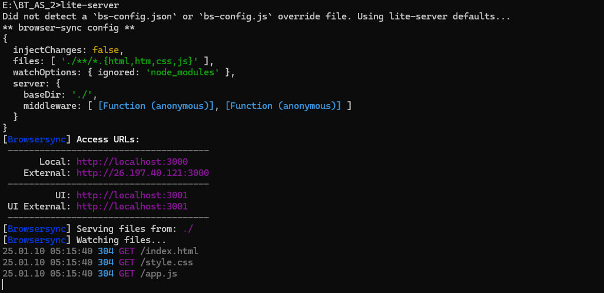
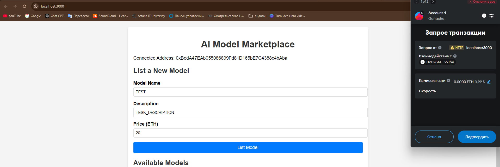
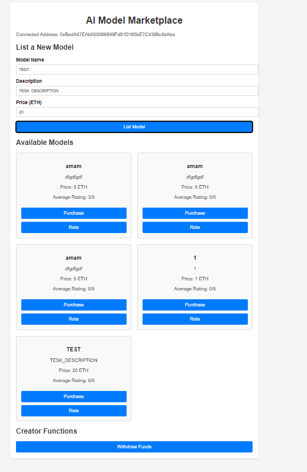
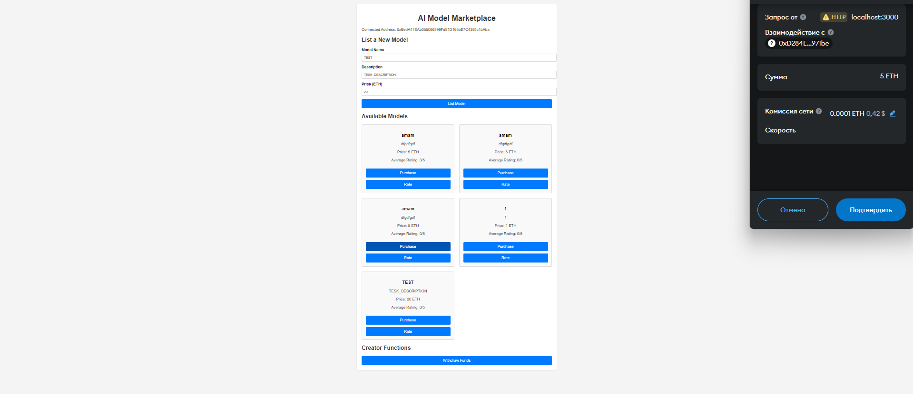
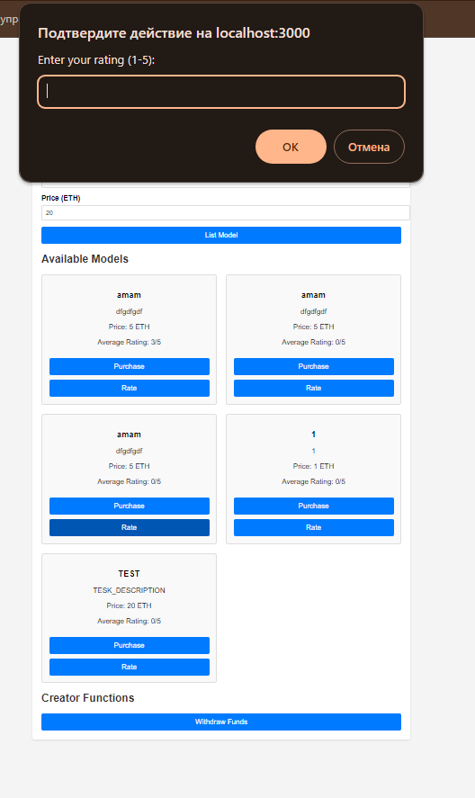
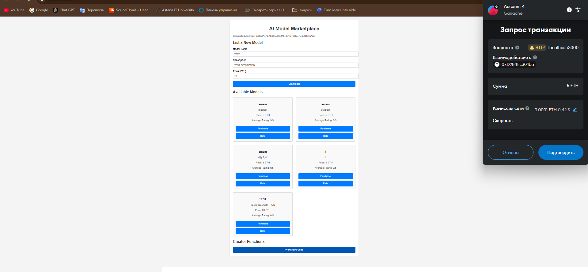

# AI Model Marketplace

AI Model Marketplace is a decentralized marketplace for AI models built on Ethereum using smart contracts. Users can list AI models, purchase them, rate them, and creators can withdraw their earnings. This project uses **Truffle** for smart contract development and **Web3.js** for interaction with Ethereum blockchain.

## Features

- **List AI models**: Users can list AI models for sale by specifying a name, description, and price (in ETH).
- **Purchase AI models**: Users can purchase AI models by paying the listed price.
- **Rate AI models**: After purchasing a model, users can rate the model (1 to 5 stars).
- **View Model Details**: Users can view detailed information about the models including name, description, price, and average rating.
- **Creator Withdrawals**: Creators can withdraw funds from their sales of AI models.

## Project Structure

The project is divided into two main parts:

1. **Smart Contracts**: The smart contracts written in Solidity that power the marketplace.
2. **Frontend**: The user interface built using HTML, CSS, and JavaScript, which interacts with the Ethereum blockchain through Web3.js.

### Project Layout

```
/ai-model-marketplace
├── contracts/
│   ├── AIModelMarketplace.sol   # Smart contract for the marketplace
├── migrations/
│   ├── 2_initial_migration.js  # Truffle migration script
├── index.html                  # Frontend HTML page
├── style.css                   # CSS styling
├── app.js                      # JavaScript logic for interacting with the smart contract
├── truffle-config.js           # Truffle configuration file
├── package.json                # Project dependencies and scripts
├── README.md                   # Project documentation
```

## Installation

### Prerequisites

- **Node.js** and **npm** installed. You can download Node.js from [here](https://nodejs.org/).
- **Truffle** for smart contract development. Install it globally:

  ```bash
  npm install -g truffle
  ```

- **Ganache** for running a local Ethereum blockchain. Download it from [here](https://www.trufflesuite.com/ganache).
- **MetaMask** browser extension to interact with the blockchain.

### Step 1: Clone the repository

```bash
git clone https://github.com/Rerukuka/ai-model-marketplace.git
cd ai-model-marketplace
```

### Step 2: Install project dependencies

Run the following command to install the required Node.js packages:

```bash
npm install
```

### Step 3: Configure the Ethereum network

Make sure **MetaMask** is installed in your browser and connected to a test network (like **Ganache** or **Rinkeby**).

#### Set up Ganache:

1. Open Ganache and create a new workspace or use the default settings.
2. Note the Ethereum private keys and RPC server URL for use in your Truffle configuration.

#### Truffle Configuration:

Edit `truffle-config.js` and configure the network section to match your setup (e.g., Ganache):

```javascript
module.exports = {
  networks: {
    development: {
      host: "127.0.0.1",
      port: 8545,
      network_id: "*", // Match any network id
    },
  },
  compilers: {
    solc: {
      version: "0.8.0", // Specify the version of Solidity used
    },
  },
};
```

### Step 4: Deploy the smart contract

1. Compile the smart contract using Truffle:

   ```bash
   truffle compile
   ```

2. Deploy the contract to your chosen network:

   ```bash
   truffle migrate --network development
   ```

   After the contract is deployed, you will see the contract address in the terminal output. Make sure to use this address in your frontend code.

### Step 5: Run the frontend
    You must start lite-server in your cmd comand!!!!!!
   - 

## How to Use the Marketplace

### 1. List a New Model

To list a new AI model for sale:

- Go to the "List a New Model" section on the webpage.
- Enter the **Model Name**, **Description**, and **Price** (in ETH).
- Click **List Model** to add the model to the marketplace. The smart contract will record the model details on the Ethereum blockchain.
 - 

### 2. View Available Models

All listed models will appear in the "Available Models" section:

- Each model will display its **name**, **description**, **price**, and **average rating**.
- You can click the **Purchase** button to buy the model, **Rate** it (if you own the model)
 - 
### 3. Purchase a Model

To purchase a model:

- Click the **Purchase** button next to the model you want to buy.
- The system will prompt you to pay the listed price in ETH via **MetaMask**.
- Once the transaction is confirmed, the model will be yours, and you can rate it.
- 

### 4. Rate a Model

Once you've purchased a model, you can rate it between **1 to 5 stars**:

- Click the **Rate** button.
- Enter your rating (1 to 5) and submit it.
- The rating will be recorded, and the average rating of the model will be updated.
- 

### 5. Withdraw Funds (For Creators)

If you are a model creator, you can withdraw the earnings from the sale of your models:

- Go to the "Creator Functions" section and click **Withdraw Funds**.
- The funds will be transferred to your Ethereum account.
- 

## Smart Contract Functions

### listModel

This function allows users to list a new AI model on the marketplace.

```solidity
function listModel(string memory name, string memory description, uint256 price) public
```

- **Parameters**: 
  - `name`: Name of the model.
  - `description`: A short description of the model.
  - `price`: Price of the model in wei (1 ETH = 10^18 wei).
  
- **Usage**: 
  - Allows users to add a model for sale.
  - Emits the `ModelListed` event.

### purchaseModel

This function enables users to purchase a model by sending the required ETH.

```solidity
function purchaseModel(uint256 modelId) public payable
```

- **Parameters**: 
  - `modelId`: The ID of the model to purchase.

- **Usage**: 
  - Allows users to buy models by paying the specified price in ETH.
  - Emits the `ModelPurchased` event.

### rateModel

This function allows users to rate a purchased model.

```solidity
function rateModel(uint256 modelId, uint8 rating) public
```

- **Parameters**: 
  - `modelId`: The ID of the model to rate.
  - `rating`: A rating between 1 and 5.

- **Usage**: 
  - Allows users to rate the model after purchase.
  - Emits the `ModelRated` event.

### withdrawFunds

Creators can withdraw the funds they’ve earned from their models.

```solidity
function withdrawFunds() public
```

- **Usage**: 
  - Allows the creator to withdraw the funds from their model sales.

### getModelDetails

This function returns detailed information about a specific model.

```solidity
function getModelDetails(uint256 modelId) public view returns (string memory, string memory, uint256, address, uint8)
```

- **Parameters**: 
  - `modelId`: The ID of the model.
  
- **Returns**: 
  - Returns the name, description, price, creator's address, and average rating.

### getModelsCount

This function returns the total number of models listed on the marketplace.

```solidity
function getModelsCount() public view returns (uint256)
```

- **Returns**: 
  - The total number of models.

## Contributing

Feel free to fork this repository, make changes, and submit pull requests. If you encounter any issues, open an issue on GitHub.

## License

This project is licensed under the MIT License - see the [LICENSE](LICENSE) file for details.

## Additional Information

For any questions or help, feel free to reach out to the project maintainers via GitHub issues or contact info.
